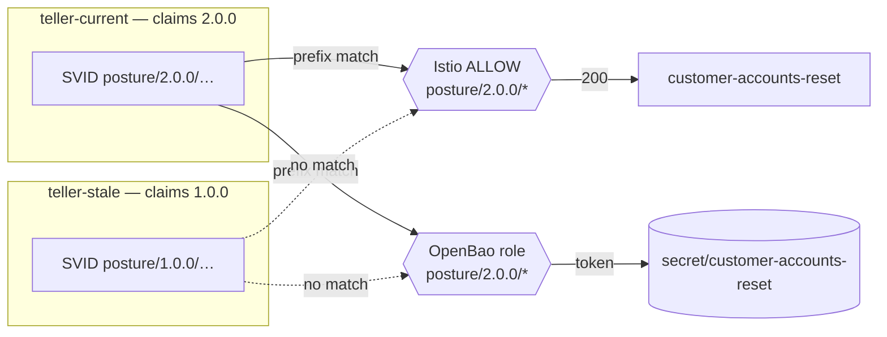

# reset — posture-gated reach + secrets (workload flagship, ticket 17)

`customer-accounts-reset` is tuppence's sensitive service. It accepts a caller
**only if that caller's SPIRE SVID attests the current policy version**, and
OpenBao issues its credential only to the same current-posture identities. A
caller drifting out of currency loses **reach and its secret**, live — with no
per-service allowlist and no trust in network position.

## One attestation, two surfaces

Ticket 15 baked posture into the SVID **path** (leading segment):
`spiffe://acme.internal/posture/<vN>/ns/<ns>/sa/<sa>`. This ticket gates two
surfaces on that one signed property, both with the **same** current-version
prefix glob:

| surface | file | mechanism |
|---|---|---|
| **reach** | `authorizationpolicy.yaml` | Istio `AuthorizationPolicy` ALLOW, `source.principals: spiffe://…/posture/2.0.0/*` |
| **secret** | `openbao-role.yaml` | OpenBao jwt role, `bound_claims` glob `sub: spiffe://…/posture/2.0.0/*` |

Posture leads the path, so **one** prefix wildcard matches every current
identity regardless of ns/sa. ALLOW-only ⇒ Istio default-denies unmatched
callers; a failed `bound_claims` ⇒ OpenBao refuses login. No explicit Deny.



## "Current" is one value, moved by one edit

The prefix is `2.0.0` — the latest element of platform's version array
(`estate/platform/distribution/versions.yaml`). Bump the bar (or retire 2.0.0)
by editing both globs to the new version; `reach.py selfcheck` **asserts the two
globs agree**, so reach and secret can never drift to different versions. A pod
that later falls out of currency is de-postured by the currency controller
(ticket 16) → drops to the base SVID → matches neither glob → loses both.

## Verify

```bash
python3 reach.py selfcheck        # the gate as pure logic — current wins both, stale loses both
./verify-reach-secrets.sh         # offline proof + live tail (reach 200/refused, secret read/refused)
```

Offline is the demonstrable claim (glob agreement + admit/refuse matrix, parsed
from the real manifests). The live tail runs only when the identity substrate
and these workloads are on the cluster.

## Bring-up

Prereqs, in order (they install what this depends on):

```bash
estate/platform/identity/up.sh    # SPIRE + Istio + OpenBao + jwt seam
estate/platform/posture/up.sh     # stamp-posture + trust-boundary + posture ClusterSPIFFEID
estate/tuppence/reset/up.sh       # this: workloads + reach gate + secret gate
```

`CTX` defaults to `kind-driftwood` (where the identity substrate runs). Idempotent.
